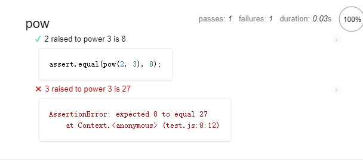

# JavaScript | 浏览器调试与代码测试 <!-- omit in toc -->

介绍如何使用现代浏览器进行简单的代码调试与编写自动化测试。

## 目录 <!-- omit in toc -->

- [浏览器控制台](#%e6%b5%8f%e8%a7%88%e5%99%a8%e6%8e%a7%e5%88%b6%e5%8f%b0)
- [Chrome 调试快捷键](#chrome-%e8%b0%83%e8%af%95%e5%bf%ab%e6%8d%b7%e9%94%ae)
- [debugger 命令](#debugger-%e5%91%bd%e4%bb%a4)
- [日志记录](#%e6%97%a5%e5%bf%97%e8%ae%b0%e5%bd%95)
- [代码编写规范](#%e4%bb%a3%e7%a0%81%e7%bc%96%e5%86%99%e8%a7%84%e8%8c%83)
- [自动化测试](#%e8%87%aa%e5%8a%a8%e5%8c%96%e6%b5%8b%e8%af%95)
  - [常用库](#%e5%b8%b8%e7%94%a8%e5%ba%93)
  - [样例](#%e6%a0%b7%e4%be%8b)
  - [其他函数](#%e5%85%b6%e4%bb%96%e5%87%bd%e6%95%b0)
  - [其他断言](#%e5%85%b6%e4%bb%96%e6%96%ad%e8%a8%80)

<br>

---

<br>


## 浏览器控制台

在浏览器（如 Firefox 与 Chrome）中的控制台测试功能时，换行需要使用 <kbd>Shift</kbd>+<kbd>Enter</kbd> 键，单独的 <kbd>Enter</kbd> 键会直接运行代码。

或者尝试以下方法：

```js
(function() {
    "use strict";

    // 脚本代码...

})
```

<br>

## Chrome 调试快捷键

| 快捷键                          | 功能               |
| ------------------------------- | ------------------ |
| <kbd>F8</kbd>                   | 继续执行           |
| <kbd>F10</kbd>                  | 下一步（跳过函数） |
| <kbd>F11</kbd>                  | 下一步（进入函数） |
| <kbd>Shift</kbd>+<kbd>F11</kbd> | 执行到函数末尾     |

此外，在代码的某一行右键菜单中有一个“Continue to here”的选项运行代码到指定位置，十分方便。

<br>

## debugger 命令

```js
function hello(name) {
  let phrase = `Hello, ${name}!`;
  debugger;  // <-- 调试器会在这停止
  say(phrase);
}
```

<br>

## 日志记录

```js
console.log(msg);
```
消息会发送到控制台中。

<br>

## 代码编写规范

 [javascript.info](https://zh.javascript.info) 上有一篇反讽糟糕的编写习惯的文章值得一阅：[ninja code](https://zh.javascript.info/ninja-code)

<br>

## 自动化测试

### 常用库

在原教程中使用了一下 JavaScript 库进行测试：

- Mocha —— 核心框架：提供了包括 `describe` 和 `it` 的通用型测试函数和运行测试的主函数。
- Chai —— 提供很多断言支持的库。它可以用很多不同的断言。现在我们只需要用 `assert.equal`。
- Sinon —— 用于监视函数、模拟内置函数和其他函数的库。

### 样例

```js
function pow() {
  return 8; // :) 我们作弊啦！
}

describe("pow", function() {

  it("2 raised to power 3 is 8", function() {
    assert.equal(pow(2, 3), 8);
  });

  it("3 raised to power 3 is 27", function() {
    assert.equal(pow(3, 3), 27);
  });

});
```

`describe("title", function() { ... })`

表示我们正在描述的功能是什么。用于组织 `it` 代码块。

`it("title", function() { ... })`

it 里面的 “title” 中我们以人类可读的方式描述特定的用例，第二个参数是一个测试它的函数。

最好一个it函数体内写一个测试，否则前面的测试报错会停止后面的测试。

`assert.equal(value1, value2)`

it 块中的代码。

将改代码包含进HTML页面中：

```HTML
<!DOCTYPE html>
<html>
<head>
  <!-- add mocha css, to show results -->
  <link rel="stylesheet" href="https://cdnjs.cloudflare.com/ajax/libs/mocha/3.2.0/mocha.css">
  <!-- add mocha framework code -->
  <script src="https://cdnjs.cloudflare.com/ajax/libs/mocha/3.2.0/mocha.js"></script>
  <script>
    mocha.setup("bdd"); // minimal setup
  </script>
  <!-- add chai -->
  <script src="https://cdnjs.cloudflare.com/ajax/libs/chai/3.5.0/chai.js"></script>
  <script>
    // chai has a lot of stuff, let's make assert global
    let assert = chai.assert;
  </script>
</head>

<body>

  <script>
    function pow() {
      return 8; // :) 我们作弊啦！
    }
  </script>

  <!-- the script with tests (describe, it...) -->
  <script src="test.js"></script>

  <!-- the element with id="mocha" will contain test results -->
  <div id="mocha"></div>

  <!-- run tests! -->
  <script>
    mocha.run();
  </script>
</body>

</html>
```

该页面内容可分为四部分：

1. `<head/>` 为测试添加第三方库和样式文件。
2. `<script/>` 包含测试函数，在我们的例子中 --和 pow 相关的代码。
3. `test.js` 测试代码 – 包含上面 `describe("pow", ...)`。
4. HTML 元素 `<div id="mocha"/>` 将会被 Mocha 用来输出结果。

测试将以 mocha.run() 命令开始。

效果：



另：测试函数支持嵌套。

### 其他函数

包含于`Mocha`库中还有一些函数。

例如 `before/after 和 beforeEach/afterEach`

例子：

```js
describe("test", function() {

  before(() => alert("Testing started – before all tests"));
  after(() => alert("Testing finished – after all tests"));

  beforeEach(() => alert("Before a test – enter a test"));
  afterEach(() => alert("After a test – exit a test"));

  it("test 1", () => alert(1));
  it("test 2", () => alert(2));

});
```

### 其他断言

`Chai`库中的常用断言例如：

| 断言函数                               | 作用                           |
| -------------------------------------- | ------------------------------ |
| assert.equal(value1, value2)           | 检测相等 value1 == value2      |
| assert.strictEqual(value1, value2)     | 检测严格相等 value1 === value2 |
| assert.notEqual, assert.notStrictEqual | 刚好和上面做相反的检查         |
| assert.isTrue(value)                   | 检查 value === true            |
| assert.isFalse(value)                  | 检查 value === false           |
| assert.isNaN(value)                    | 检查 value === NaN             |

更多请查看[docs](https://www.chaijs.com/api/assert/)

<br>

---

<br>

## 更多内容 <!-- omit in toc -->

返回[个人笔记导航😊](../README.md)
